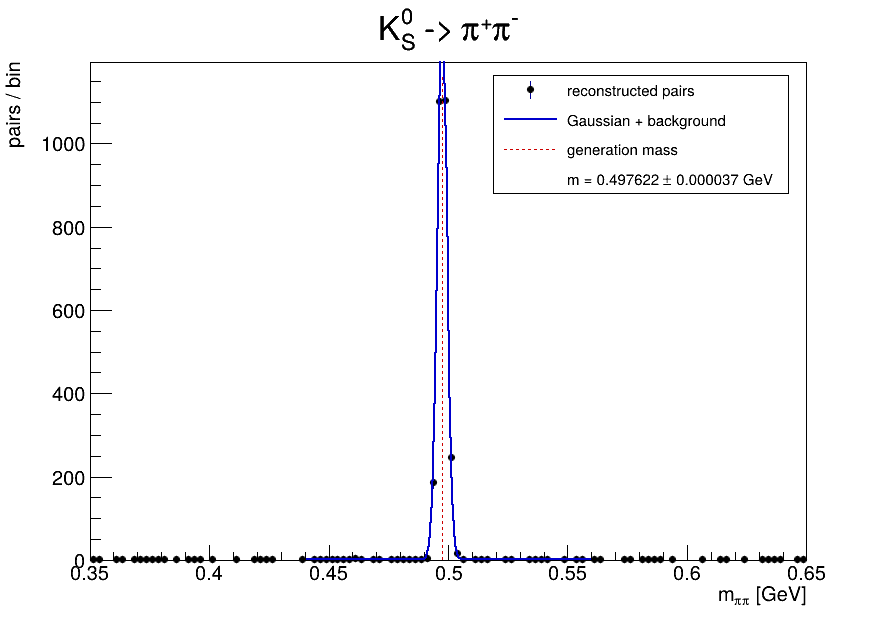
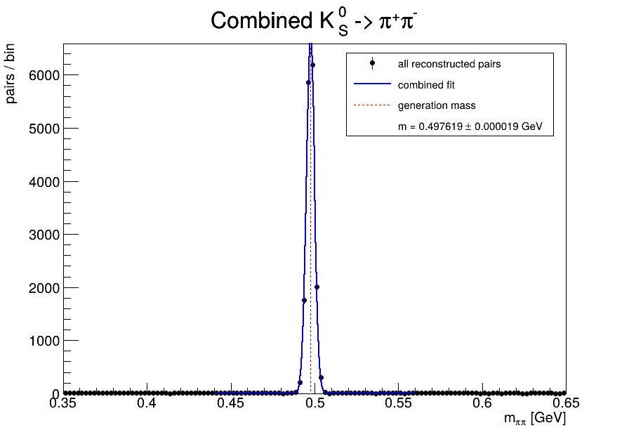

# ROOT invariant-mass reconstruction

This example mimics a tiny collider-analysis production. Six independent synthetic runs contain pion-pair four-vectors. Each run is generated and then reconstructed independently; the final task merges the per-run mass histograms and fits the combined peak.

```text
generate-00 -> reconstruct-00 --+
generate-01 -> reconstruct-01 --+
...                              +--> merge
generate-05 -> reconstruct-05 --+
```

Signal events are two-body `K_S^0 -> pi+ pi-` decays with `m(K_S^0) = 497.611 MeV`. The daughters are boosted to the lab, smeared with a small momentum resolution, and mixed with combinatorial background pairs. `reconstruct.py` uses `TLorentzVector` to rebuild the invariant mass and fits a Gaussian plus linear background.

This is deliberately closer to ordinary HEP event processing than the numerical examples: many small ROOT files are processed independently and then merged.

The ROOT environment is exactly the MCMC launcher, `../mcmc/run-pyroot.sh`.

## Example output

Each `reconstruct-{run}` task builds and fits its own invariant-mass spectrum. Here is run 00:



The other independent run fits are [01](figures/run-01-fit.png), [02](figures/run-02-fit.png), [03](figures/run-03-fit.png), [04](figures/run-04-fit.png), and [05](figures/run-05-fit.png).

The final `merge` task adds the six reconstructed histograms and fits the combined peak, with the generated `K_S^0` mass shown for reference:



This is the familiar HEP production pattern in miniature: independent event processing produces per-run ROOT objects, followed by a merge and a higher-statistics final fit.

## Run

```bash
cd examples/invariant-mass
yawl-run validate
yawl-run plan
yawl-run create -j 6 | yawl-run start
cat mass-work/summary.txt
```
