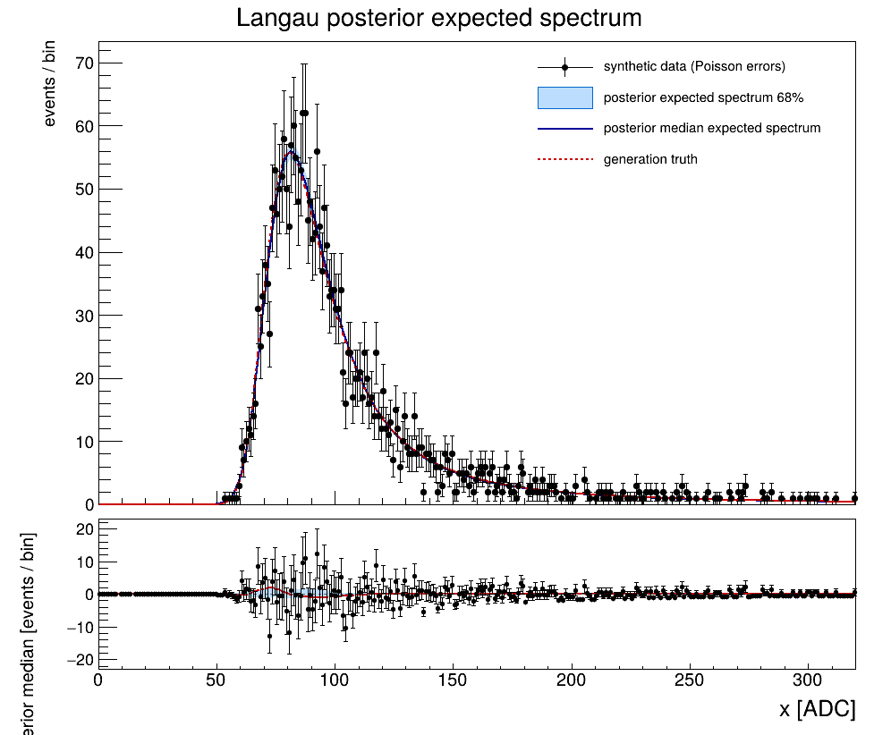
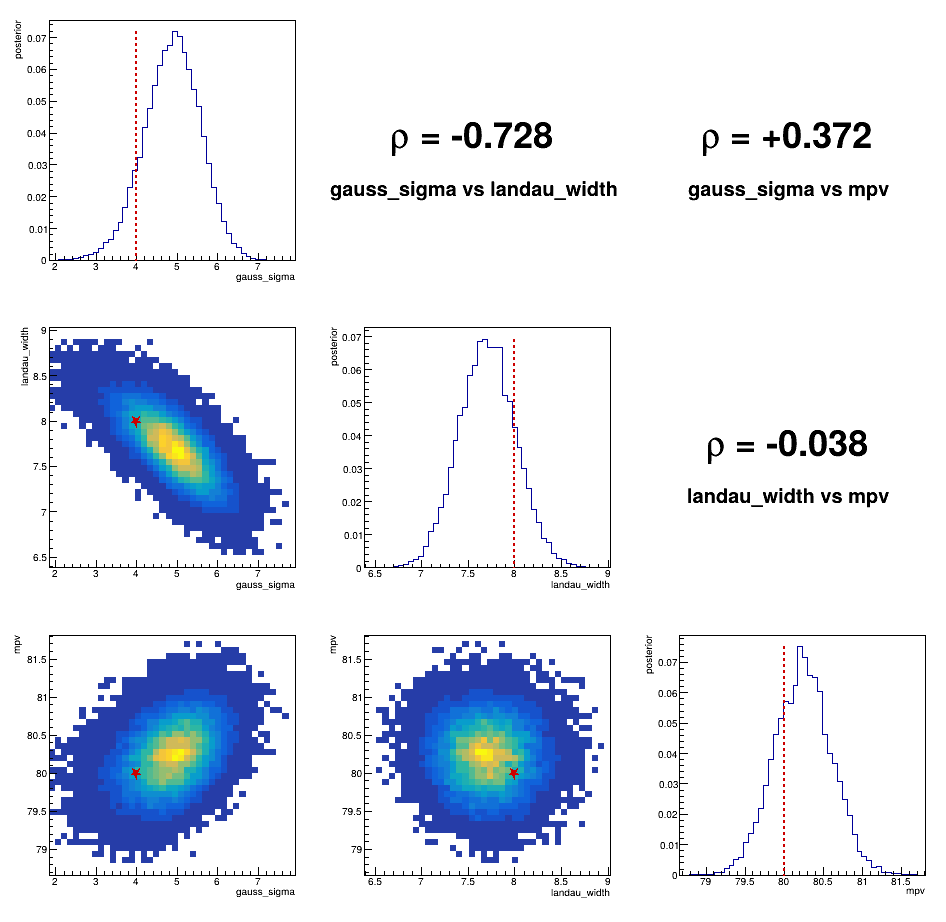
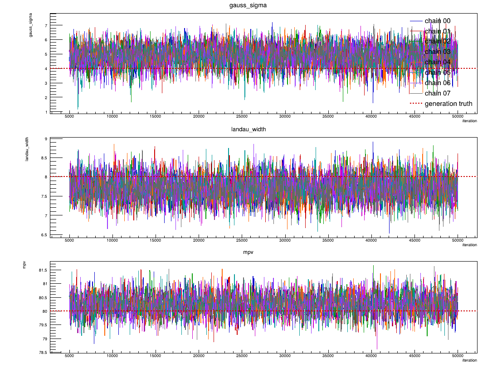

# PyROOT RooStats MCMC: a low-statistics LFHCal-like Langau posterior

This example runs eight independent Bayesian Markov chains for a synthetic
Landau convolved with Gaussian ("Langau") spectrum. Unlike the small numerical
examples, the statistical engine here is ROOT itself:

- `RooLandau` and `RooGaussian` define the components;
- `RooFFTConvPdf` performs the numerical convolution;
- `RooStats::MCMCCalculator` runs Metropolis-Hastings chains;
- each chain is written to its own ROOT file;
- the chains are combined, checked with split R-hat, and plotted with ROOT.

The workflow is intended both as a realistic yawl-run example and as a compact
starting point for MCMC studies of detector spectra.

## Model

The likelihood is a Landau distribution convolved with a Gaussian detector
resolution:

```text
f(x | MP, sigma_L, sigma_G) = Landau(x; MP, sigma_L) * Gaussian(x; 0, sigma_G)
```

with three floating shape parameters:

- `mpv`: the corrected Landau most-probable value;
- `landau_width`: Landau scale parameter;
- `gauss_sigma`: Gaussian detector resolution.

The synthetic data reproduce the low-statistics LFHCal/HGCROC toy case that
motivated this example:

```text
mpv = 80 ADC
landau_width = 8 ADC
gauss_sigma = 4 ADC
events = 2500
```

The Landau is intentionally much broader than the Gaussian. At 2,500 events,
finite-statistics fluctuations can make the two width contributions difficult
to separate, so the posterior correlation and chain convergence are physically
interesting rather than merely a demonstration that MCMC runs.

The observable spans 0--320 ADC in one-ADC bins. The convolution uses 4096
cache bins.

### MP convention

ROOT's underlying Landau implementation has its maximum at about
`-0.22278298 * width` when its location parameter is zero. The classic ROOT
`langaus` function used by the LFHCal calibration code corrects this shift so
that its MP parameter is the actual maximum of the unconvolved Landau.

This example makes the same correction. The sampled `mpv` therefore has the
same meaning as the MP parameter in the earlier LFHCal toy study, while an
internal `landau_location` formula supplies the corresponding location to
`RooLandau`.

### Why there is no peak-height parameter

`RooFFTConvPdf` is a normalized probability density. This example conditions on
the observed number of events, so the histogram normalization is supplied by
the dataset size rather than sampled as another parameter. For a given event
count and the three shape parameters, the expected peak height is therefore a
derived quantity.

The older LFHCal `langaufun` fit did have a fourth parameter, but it was total
area (normalization), not peak height itself. An extended RooFit model could add
a yield parameter if we want to study normalization uncertainty separately.
For the present experiment, keeping the event count fixed isolates the
low-statistics degeneracy between Landau width and Gaussian resolution.

`mpv` is the RooStats parameter of interest; the two width parameters are
registered as nuisance parameters, but all three are sampled and included in
the diagnostics and corner plot. Uniform priors are used over the finite
parameter ranges encoded in the `RooRealVar`s. The broad MP prior follows the
range used in the earlier toy-fit study, and the sequential proposal is scaled
to make sensible moves within those broad ranges.

## Why eight chains?

A Metropolis-Hastings chain is serial: proposal n+1 depends on the state reached
at proposal n. The useful parallelism is therefore *between* independent
chains, not within one chain.

```text
prepare
   |
   +-- chain-00 --+
   +-- chain-01 --+
   +-- chain-02 --+
   +-- chain-03 --+--> combine --> diagnose --> plots
   +-- chain-04 --+
   +-- chain-05 --+
   +-- chain-06 --+
   +-- chain-07 --+
```

With eight available CPUs, eight chains can accumulate roughly eight times the
posterior exploration in about the wall time of one chain. More importantly,
independent seeds give an actual convergence test: chains that have not mixed
to the same posterior will show up in the trace plots and split R-hat.

Each chain descriptor in `chains/` contains

```text
ITERATIONS BURN_IN
```

The chain number comes from the filename (`chain-00.txt`, etc.), and the
reproducible seed is `41001 + chain_id`. The committed example uses 50,000
iterations with 5,000 burn-in iterations per chain. Edit those tiny descriptor
files if you want a shorter smoke test or a longer statistical run.

## PyROOT and the EIC container

You do not need to install PyROOT into the host Python just to run this example.
Every ROOT-dependent task goes through `run-pyroot.sh`, which chooses an
execution environment in this order:

1. If the host `python3` can import ROOT and expose
   `RooStats.MCMCCalculator`, use it directly.
2. If `YAWL_MCMC_EIC_SHELL` names a generated outer `eic-shell` script, use it.
3. Otherwise execute the payload directly in an EIC Apptainer/Singularity
   image.

For the container path, the launcher checks `YAWL_MCMC_EIC_IMAGE`, then the
LFHCal-compatible `LFHCAL_CONTAINER_IMAGE`, then defaults to the standard EIC
CVMFS image used at sites such as BNL and JLab:

```text
/cvmfs/singularity.opensciencegrid.org/eicweb/eic_xl:nightly
```

It also binds the common EIC/BNL shared paths that exist on the host.

On a BNL or JLab machine with that CVMFS image visible, the ordinary run command
below should therefore require no separate ROOT installation. To select a
different image in csh/tcsh:

```csh
setenv YAWL_MCMC_EIC_IMAGE /path/to/eic_xl-image
```

If you already have a generated EIC shell instead:

```csh
setenv YAWL_MCMC_EIC_SHELL /path/to/eic-shell
```

Set `YAWL_MCMC_FORCE_EIC=1` if you want to use the container even when the host
Python happens to have PyROOT.

For a reproducibility-sensitive scientific calculation, prefer a pinned EIC
container release or immutable image rather than `nightly`.

## Outputs

The final directory contains:

```text
mcmc-work/
    model.root
    chain-00.root
    ...
    chain-07.root
    posterior.root
    diagnostics.json
    summary.txt
    corner.pdf
    corner.png
    traces.pdf
    traces.png
    posterior_predictive.pdf
    posterior_predictive.png
```

`corner` contains one-dimensional posteriors on the diagonal, pairwise
two-dimensional posterior densities below the diagonal, and correlation
coefficients above it.

`traces` overlays all eight chains for each model parameter.

`posterior_predictive` compares the synthetic data with the posterior median
expected spectrum, a central 68% posterior expected-spectrum band, and the
known generation truth. Its lower panel shows `data - posterior median` with
Poisson counting errors; the blue band is the same posterior expected-spectrum
range shifted into residual coordinates.

The ROOT chain files store the Markov chain in compressed form. Rejected
Metropolis proposals are represented by the `weight` of the retained state
rather than by duplicating rows. `diagnose.py` expands those weights logically
when calculating posterior summaries and split R-hat.

## Example result

The committed figures below come from the reproducible 2,500-event toy run.
They illustrate the feature this example was built to expose: the observed
Langau spectrum can be tightly constrained even when the decomposition of its
width into Landau and Gaussian contributions is not.

### Expected spectrum and residuals



The black points are the synthetic data with Poisson counting errors. The blue
curve is the posterior median expected spectrum, the blue band is the central
68% range of the expected spectrum over posterior parameter draws, and the red
dashed curve is the generation truth.

The residual panel uses `data - posterior median`. Around the peak, the observed
bin-to-bin fluctuations are much larger than the width of the blue posterior
expected-spectrum band. The red truth-minus-median curve stays close to zero.
This is an important distinction: the blue band describes uncertainty in the
underlying expected spectrum, not the Poisson scatter of a new observed
histogram.

### Parameter posterior



The red dashed lines and red stars mark the generating values
`gauss_sigma = 4`, `landau_width = 8`, and `mpv = 80`. In this seeded run the
strongest correlation is between Gaussian resolution and Landau width,
`rho = -0.728`. The generating point lies within the posterior support but away
from the highest-density part of that diagonal ridge. A larger Gaussian width
can therefore be compensated by a smaller Landau width, with little visible
change in the spectrum.

The MP is much less entangled with the Landau width (`rho = -0.038` here), while
its correlation with the Gaussian width is modest (`rho = +0.372`). The corner
plot makes the low-statistics width degeneracy visible in a way a single
best-fit result does not.

### Chain traces



All eight post-burn-in chains overlap and explore the same regions of parameter
space. The red dashed lines show the generation truth. No chain remains visibly
isolated from the others, so the displaced marginal peaks in the corner plot
are not simply one chain getting stuck in a different mode. The numerical split
R-hat values written by `diagnose.py` provide the corresponding quantitative
convergence check.

Taken together, the figures show why this low-statistics toy is useful for the
LFHCal calibration problem: a fit can reproduce the measured spectrum very
well while assigning noticeably different values to the two width components.

## Run

```bash
cd examples/mcmc
yawl-run validate
yawl-run plan
yawl-run create -j 8 | yawl-run start
cat mcmc-work/summary.txt
```

For Condor, change the backend in the Yawlfile or use the supported backend
override when creating the campaign, then start the created campaign.

On a high-latency shared filesystem, put the yawl campaign record on local
scratch if you are measuring local orchestration overhead:

```bash
yawl-run create -j 8 --campaigns-dir /tmp/yawl-campaigns | yawl-run start
```

The scientific outputs still go to `mcmc-work/` in the example directory.

## Reproducibility

The generated dataset has a fixed seed. Each MCMC chain has a separate fixed
seed derived from its descriptor filename and recorded in ROOT metadata, so
rerunning the same example with the same ROOT version and execution image should
reproduce the same stochastic calculation closely. ROOT/image details and yawl
task provenance remain separate concerns: yawl records how the tasks ran, while
the ROOT files record the statistical samples they produced.
