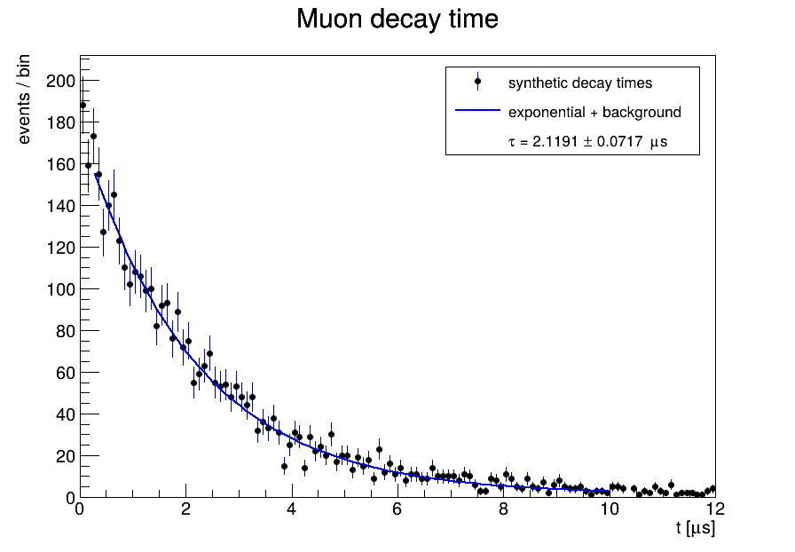
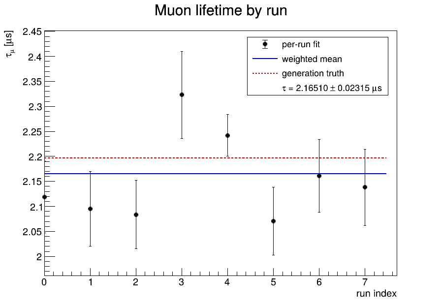

# ROOT muon lifetime: parallel run pipelines

This example treats eight small synthetic stopped-muon runs as independent miniature experiments. Each run goes through a serial ROOT pipeline,

```text
simulate-00 -> fit-00 -> check-00 --+
simulate-01 -> fit-01 -> check-01 --+
...                                  +--> combine
simulate-07 -> fit-07 -> check-07 --+
```

while different runs execute in parallel. The final task combines the checked per-run lifetime measurements with inverse-variance weighting.

The generated decay times follow an exponential with `tau_mu = 2.1969811 us` plus a small flat accidental background. `fit.py` uses a ROOT `TH1D` and `TF1`; `combine.py` writes a ROOT graph, summary, and plot.

The point of the example is the workflow topology: patterned tasks inherit pairwise dependencies (`fit-{run}: simulate-{run}` and `check-{run}: fit-{run}`), followed by a static fan-in.

All ROOT-dependent commands use `../mcmc/run-pyroot.sh`, so the example has the same host-PyROOT / EIC-container behavior as the MCMC example.

## Example output

Each `fit-{run}` task plots the decay-time histogram together with its exponential-plus-background fit. Here is run 00:



The other independently fitted runs are [01](figures/run-01-fit.png), [02](figures/run-02-fit.png), [03](figures/run-03-fit.png), [04](figures/run-04-fit.png), [05](figures/run-05-fit.png), [06](figures/run-06-fit.png), and [07](figures/run-07-fit.png).

After all eight checks succeed, `combine` plots the per-run lifetime measurements, their inverse-variance weighted mean, and the known generation truth:



This makes the workflow structure visible in the scientific output: eight independent measurements are produced in parallel, then reduced to one combined result.

## Run

```bash
cd examples/muon-lifetime
yawl-run validate
yawl-run plan
yawl-run create -j 8 | yawl-run start
cat muon-work/summary.txt
```

Change the backend to Condor to run the same graph through DAGMan.
