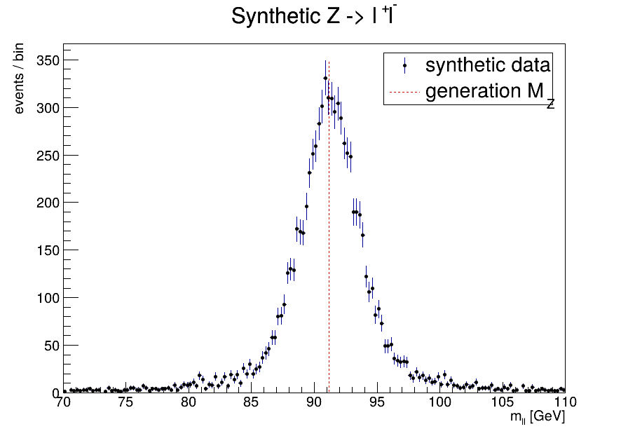
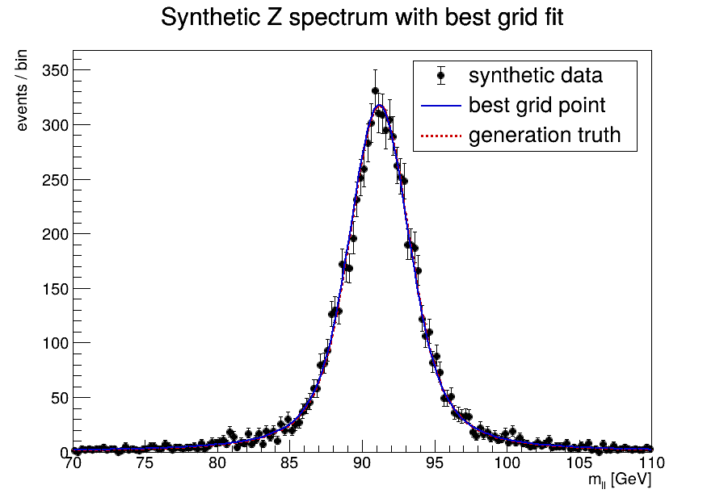
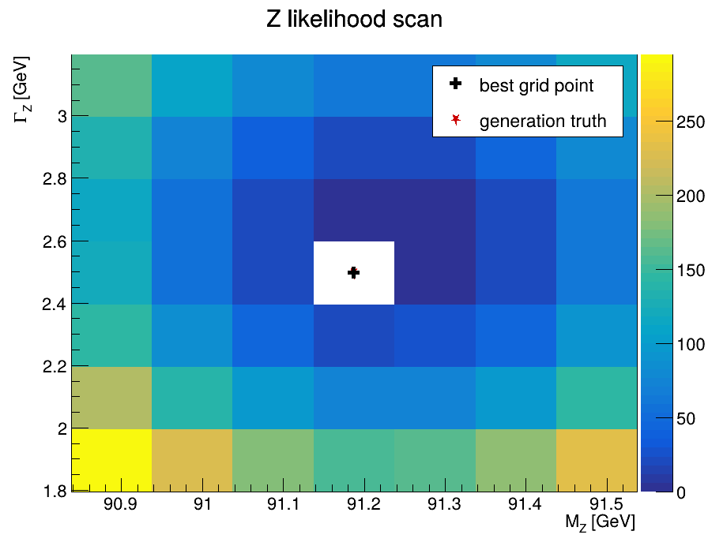

# ROOT Z-resonance likelihood scan

This example is a classic batch-farm parameter sweep. `prepare` generates one small synthetic dilepton-mass histogram for a Z-like resonance. Forty-nine independent `scan-{id}` tasks evaluate the RooFit negative log likelihood at a 7 x 7 grid of `(M_Z, Gamma_Z)` points, and one final task assembles the two-dimensional `2 Delta NLL` surface.

```text
                 +--> scan-00 --+
                 +--> scan-01 --+
prepare ---------+      ...      +--> combine
                 +--> scan-48 --+
```

The synthetic truth is `M_Z = 91.1876 GeV`, `Gamma_Z = 2.4952 GeV`, with a fixed `1.5 GeV` Gaussian detector resolution. The generator uses ROOT's Breit-Wigner random variate plus Gaussian smearing; each likelihood job uses `RooBreitWigner`, `RooGaussian`, and `RooFFTConvPdf`.

This deliberately illustrates a different kind of parallelism from the MCMC example. MCMC parallelizes independent *chains*; this example parallelizes independent *likelihood points*. The computation is tiny enough to keep in the repository, but the graph is the same shape as parameter scans with thousands of batch jobs.

All ROOT tasks use `../mcmc/run-pyroot.sh`.

## Example output

`prepare` first creates the synthetic dilepton-mass spectrum that every likelihood task reads:



After the 49 independent likelihood evaluations finish, `combine` identifies the best grid point and overlays that model on the same data:



The final reduction also assembles the full `2 Delta NLL` surface. The generation truth and the best scanned grid point are marked on the surface:



The three plots show the whole fan-out/fan-in story: one shared data set, many independent likelihood calculations, then one global result.

## Run

```bash
cd examples/z-scan
yawl-run validate
yawl-run plan
yawl-run create -j 8 | yawl-run start
cat z-work/summary.txt
```
